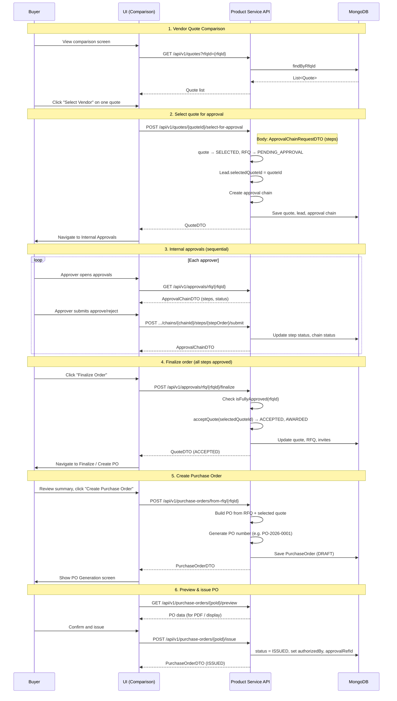
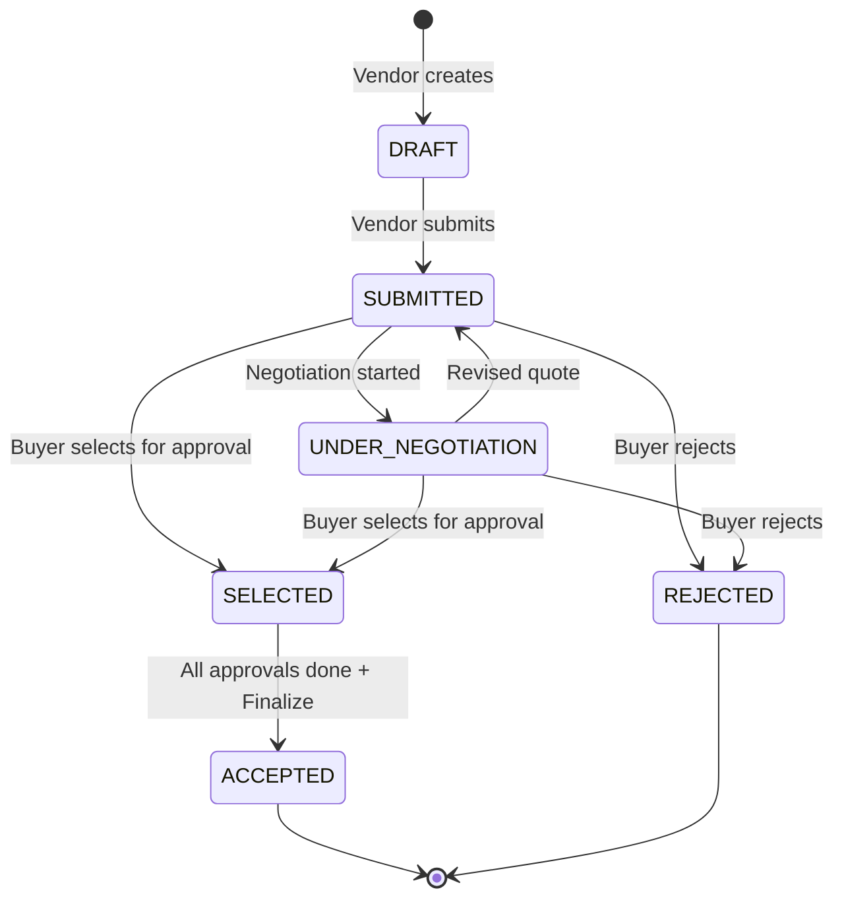
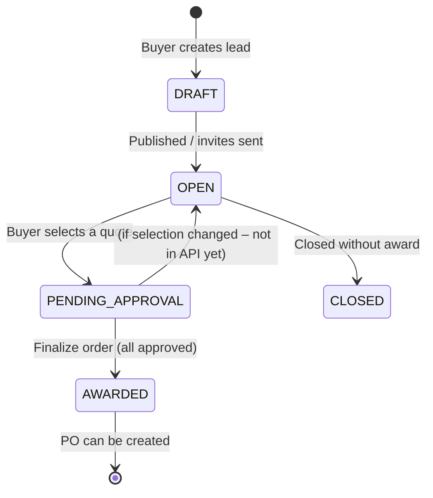

# RFQ → Quote → Approval → Purchase Order Flow

End-to-end flow from vendor quotes through internal approvals to PO creation.

---

## High-level flow diagram

```mermaid
flowchart LR
    subgraph Comparison["Vendor Quote Comparison"]
        A[Multiple vendor quotes] --> B[Buyer selects one vendor]
    end
    subgraph Approval["Internal Approvals"]
        B --> C[Approval chain created]
        C --> D[Step 1: R&D Head]
        D --> E[Step 2: QC Manager]
        E --> F[Step 3: Finance Director]
        F --> G[All approved]
    end
    subgraph Finalize["Finalize & PO"]
        G --> H[Buyer finalizes order]
        H --> I[Quote ACCEPTED, RFQ AWARDED]
        I --> J[Create Purchase Order]
        J --> K[Preview / Issue PO]
    end

    A ~~~ B ~~~ C ~~~ D ~~~ E ~~~ F ~~~ G ~~~ H ~~~ I ~~~ J ~~~ K
```



---

## Detailed sequence (API + state)



---

## State transitions

### Quote status



### RFQ (Lead) status



### Approval chain

```mermaid
flowchart LR
    PENDING --> APPROVED: All steps approved
    PENDING --> REJECTED: Any step rejected
```

---

## API endpoints summary

| Step | Method | Endpoint | Purpose |
|------|--------|----------|---------|
| Comparison | GET | `/api/v1/quotes?rfqId={rfqId}` | List quotes for RFQ |
| Select | POST | `/api/v1/quotes/{quoteId}/select-for-approval` | Select quote, create approval chain |
| Approvals | GET | `/api/v1/approvals/rfq/{rfqId}` | Get approval chain |
| Approve | POST | `/api/v1/approvals/chains/{chainId}/steps/{stepOrder}/submit` | Submit one step (X-Approver-Id) |
| Finalize | POST | `/api/v1/approvals/rfq/{rfqId}/finalize` | Finalize order (X-Buyer-Id) |
| Create PO | POST | `/api/v1/purchase-orders/from-rfq/{rfqId}` | Create PO from awarded RFQ |
| Preview PO | GET | `/api/v1/purchase-orders/{poId}/preview` | Get PO for PDF/display |
| Issue PO | POST | `/api/v1/purchase-orders/{poId}/issue` | DRAFT → ISSUED |

---

## Key entities

- **Lead (RFQ)** – `selectedQuoteId` holds the quote chosen for approval and used for PO creation.
- **Quote** – `SELECTED` = chosen for approval; `ACCEPTED` only after finalize.
- **ApprovalChain** – One per RFQ when a quote is selected; steps are sequential.
- **PurchaseOrder** – Created from awarded RFQ using `selectedQuoteId` and quote/RFQ data.
